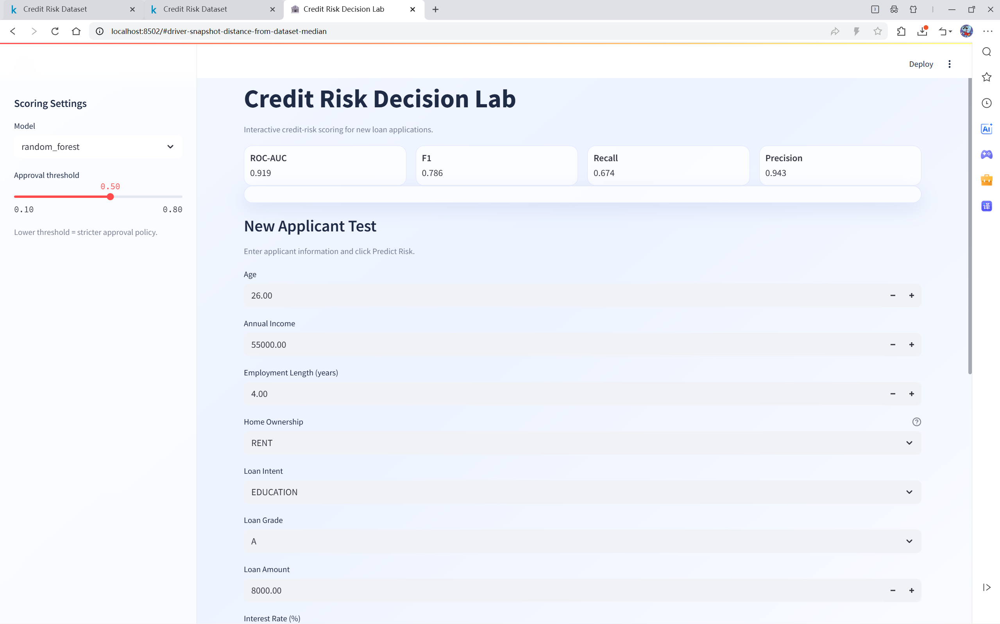
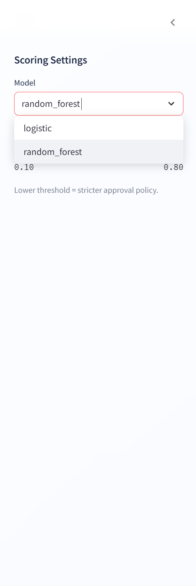
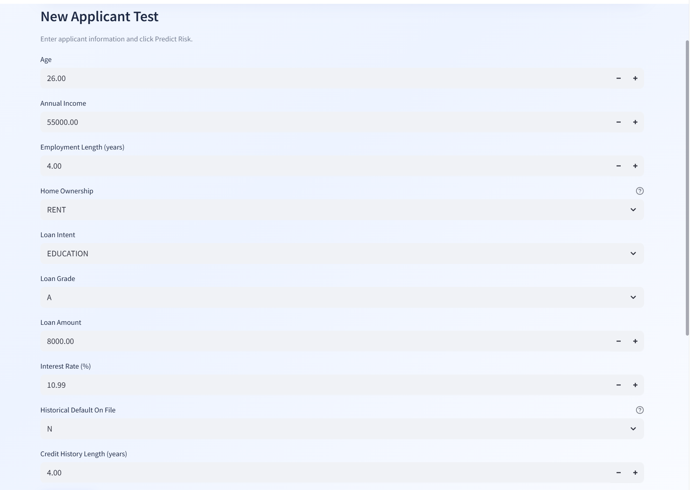
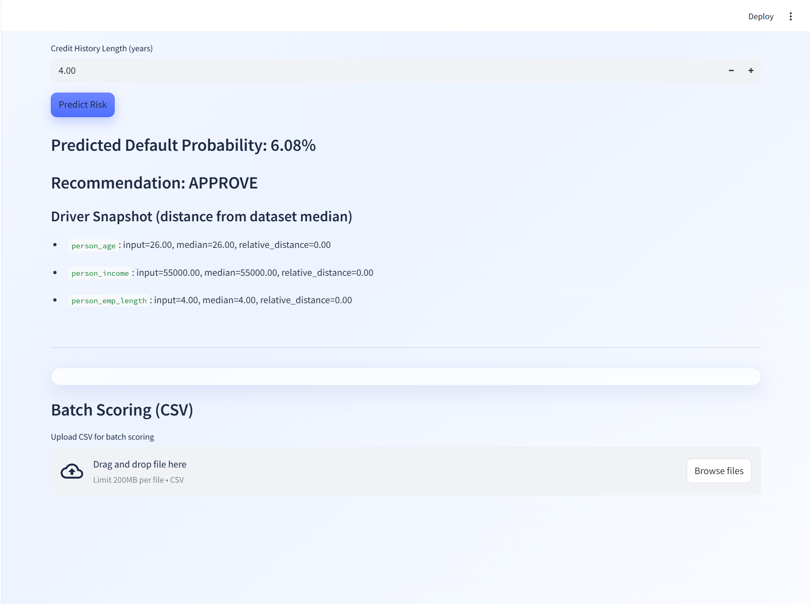
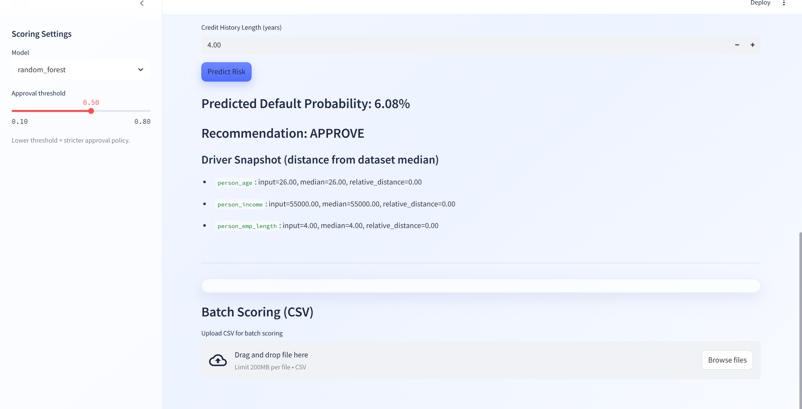
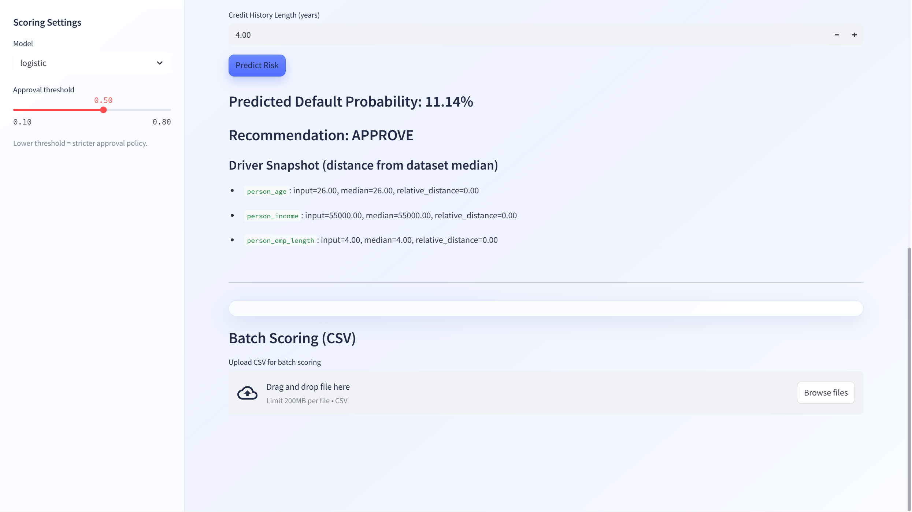

# Credit Risk Decision Lab - Reflection Report

## 1. Analytical Problem and Target User

This project addresses a practical business problem: how to support loan approval decisions with a transparent, data-driven risk estimate. The product target user is a loan officer or risk analyst who needs a fast way to screen applicants and identify high-risk cases for manual review. The goal is not to replace human judgment, but to provide a reliable default-risk signal and a consistent decision framework that can reduce subjectivity in early-stage credit screening.

The final product is an interactive Streamlit application called **Credit Risk Decision Lab**. Users can input applicant information, obtain a predicted default probability, and receive an automated recommendation under configurable thresholds. In the final demo version, the focus is on single-applicant decision support and model comparison visibility.

## 2. Dataset Selection and Source

The dataset used is the Kaggle **Credit Risk Dataset** (`credit_risk_dataset.csv`). It contains 12 columns with a binary target (`loan_status`, converted to `default_flag`) and mixed numerical/categorical features, such as age, income, employment length, loan amount, interest rate, loan intent, loan grade, home ownership, and credit history indicators.

This dataset was selected for three reasons:

1. It is directly related to a business lending scenario, matching the assignment requirement for business relevance.
2. The feature set is interpretable enough for non-technical audiences, which is important for product communication.
3. It supports meaningful Python work across the full workflow: cleaning, transformation, model training, evaluation, and deployment in an interactive interface.

Dataset link: https://www.kaggle.com/datasets/laotse/credit-risk-dataset?resource=download  
Accessed on: 15 April 2026

## 3. Python Methods and Workflow

The workflow was implemented with substantial Python components:

- **Data cleaning (`clean_data.py`)**
  - Standardized column names and unified target naming.
  - Removed duplicates and handled invalid/outlier values (age, income, employment length, rates, history length).
  - Applied median imputation for numeric missing values and `Unknown` fill for categorical missing values.
  - Exported three artifacts: cleaned dataset, cleaning report, and missing-value summary.

- **Modeling (`train_model.py`)**
  - Built preprocessing + model pipelines with `ColumnTransformer`.
  - Trained two models: Logistic Regression and Random Forest.
  - Evaluated with Accuracy, Precision, Recall, F1, and ROC-AUC.
  - Saved model files and comparison outputs for reproducibility.
  - Removed `loan_percent_income` during training to avoid dependence on a potentially redundant derived feature.

- **Interactive product (`app.py`)**
  - Implemented an interactive UI with a glassmorphism light theme.
  - Added model switch, threshold control, and single-applicant prediction.
  - Returned probability + recommendation + quick driver snapshot.

## 4. Main Findings and Outputs

The optimized Random Forest became the best-performing model in offline experiments. After tuning and threshold adjustment, model performance improved notably versus earlier iterations, and probability behavior became less biased toward high-risk outputs. For deployment stability, the online version can use a lighter model setup while keeping full model comparison evidence in the notebook and model output files.

Key product-level insights:

- Model choice and threshold setting both materially affect approval/rejection behavior.
- A lower threshold increases risk capture but can over-reject; a higher threshold improves overall accuracy and precision but may miss some risky cases.
- The app allows decision policy testing, which is valuable for explaining trade-offs to business users.

## 5. Product Design and Communication Value

The product is designed as a usable tool rather than a static analysis report:

- Clean UI for non-technical users.
- Input fields with business-readable labels.
- Real-time probability and recommendation output.
- Policy-adjustable single-case analysis for operational screening.

This supports the assignment’s “data product” orientation by translating Python analysis into a user-facing decision interface.

## 6. Limitations and Improvements

Main limitations include:

- Dataset is a public educational dataset; real-world generalization may be limited.
- No fairness audit across demographic groups was included in this version.
- Probability calibration can be further improved with dedicated calibration methods.
- Current explainability is lightweight; SHAP-style feature attribution can be added in future.
- Cloud deployment constraints (repository size and startup reliability) can limit whether heavier model artifacts are served online.

Planned improvements:

1. Add probability calibration diagnostics.
2. Add richer explainability panels.
3. Add policy simulation charts for threshold impact.
4. Validate robustness on an external dataset split.

## 7. Personal Contribution and Learning

I completed the end-to-end design and implementation of this product, including problem definition refinement, dataset replacement, data cleaning logic, model training optimization, threshold strategy testing, and Streamlit product development. I also iteratively improved UX and model behavior based on testing feedback.

The key learning outcomes are:

- How to connect technical model performance with business decision policy.
- Why feature logic consistency matters between training and deployment.
- How to present analytical work as an interactive product with clear user value.

## 8. AI Use Disclosure

The following AI support was used during the workflow:

- **Tool**: Cursor AI assistant (LLM coding assistant)  
  **Access date**: 14-15 April 2026  
  **Usage**: code refactoring suggestions, debugging support, UI wording refinement, and documentation drafting.

- **Tool**: Streamlit built-in coding references and online technical documentation  
  **Access date**: 14-15 April 2026  
  **Usage**: API usage verification and interface behavior checks.

All model choices, feature decisions, threshold strategy, and final submission content were reviewed and decided by the student. AI-generated content was checked and revised before inclusion.

---

## Figure Placeholders (replace after screenshotting)

Put all screenshots into `loan_prediction/images/` and keep the filenames below:

